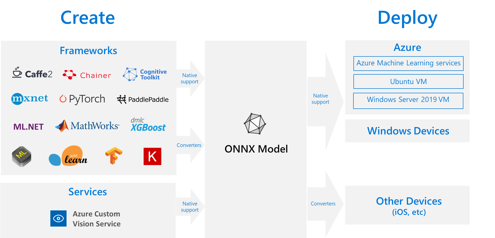

# DL Framework Portability Test


## Overview

### Objective

Use `TensorRT` to accelerate inference of a pre-trained model.


> TensorRT: NVIDIA's SDK for high-performance deep learning inference acceleration. > It includes a deep learning inference optimizer and runtime.
> 
> [NVIDIA Dev. Blog: How to Speed Up Deep Learning Inference Using TensorRT (2018.11)](https://devblogs.nvidia.com/speed-up-inference-tensorrt/)
> [NVIDIA Dev. Blog: Speeding up Deep Learning Inference Using TensorFlow, ONNX and TensorRT (2020.03)](https://devblogs.nvidia.com/speeding-up-deep-learning-inference-using-tensorflow-onnx-and-tensorrt/)
> [NVIDIA Dev. Blog: TensorRT Integration Speeds Up TensorFlow Inference(2018.03)](https://devblogs.nvidia.com/tensorrt-integration-speeds-tensorflow-inference/)





### Test

#### Case: Converting a pre-trained model to `tensorrt`

1. with `onnx` Converter

| From | To(1 depth) | To(2 depth) |
| :--- | :--- | :--- |
| `tensorflow` | `onnx` | `tensorrt` |
| ~~`pytorch`~~ | ~~`onnx`~~ | ~~`tensorrt`~~ |
| ~~`caffe`~~ | ~~`onnx`~~ | ~~`tensorrt`~~ |


2. without `onnx` Converter

| From | To(1 depth) | To(2 depth) |
| :--- | :--- | :--- |
| `tensorflow` | `tensorrt` |
| ~~`pytorch`~~ | ~~`tensorrt`~~ |
| ~~`caffe`~~ | ~~`tensorrt`~~ |


#### Task List

  1. `tensorflow` -> `onnx`
  2. `onnx` -> `TensorRT`
  3. `tensorflow` -> `TensorRT`

---

### 1. `tensorflow` -> `onnx`

#### Cases
* API Dependency
  * **__tf-native__**
    - **_low/mid level API_**(`tf_core_layers`=`tf.layers.core`)
      `tf.Session`, `tf.layer`, etc.
    - **_high-level API_**
      * `tf.estimator`
      * `tf.keras` no deps
        (Since `tf >= 1.12`, `tf.layers` are merely wrappers around `tf.keras.layers`.)
        <br>
  * **__`keras` dependent__** (before implemented in `tf.layers.core`: `tf < 1.12`)
    - **_mid level API_** (`tf.keras.layers`)
    - **_high-level API_**
      * `tf.keras`
        * dep: `keras.io`(ex. `tf.keras.applications`)
<br>

* Versions
  * `tf-1.x`
    * `1.11`
    * ~~`1.12`~~
    * `1.15`
  * `tf-2.x`
    * `2.1`
<br>

* Save Format:
  * Checkpoint(ckpt)
  * Frozen Graph & GraphDef
  * SavedModel
  * HDF5

<br>

* Device Type:
  * GPU
    * Single-GPU (1 VM)
    * Multi-GPU (1 VM)
    * Cluster Mode (VMs)

---

#### Test

<div class="alert alert-block alert-info">

> * Case:  
>   1. `1.15`  
>      1.1 low/mid level(`tf_core only`)  
>      1.2 high level(`tf.estimator`)  
>      1.3 keras-apps(`tf.keras.applications`)  
>   2. `2.1`  
>      2.1 low/mid level(`tf_core only`)
>      2.2 high level(`tf.keras`)  
>      2.3 keras-apps(`tf.keras.applications`)  
>   3. `1.11`  
>      3.1 low/mid level(`tf_core only`)  
>      3.2 high level(`tf.estimator`)  
> 
> to `ckpt`, `graph`, `savedModel.pb`


<b>Tip:</b> Use blue boxes (alert-info) for tips and notes.</div>


`onnx=1.6, 1.7`

---

### DL Frameworks

* Tensorflow == 1.12-1.15, 2.1 (onnx opset == 7-11)
* ~~PyTorch(Caffe2) 1.4~~
* ~~Caffe~~
* ONNX >= 1.6
* TensorRT


`gsutil -m cp gs://yjkim-repository/python_packages/onnx-1.7.0-cp37-cp37m-linux_x86_64.whl ./`
`gsutil -m cp gs://yjkim-repository/python_packages/onnx-1.7.0.linux-x86_64.tar.gz ./`
`gsutil -m cp gs://yjkim-repository/python_packages/onnx-1.7.0.tar.gz ./`


```sh
gcloud beta compute ssh --zone "us-central1-a" "yjkim-dl-gpu-template-1" --project "ds-ai-platform"
```


> Checkpoint: 
> The above code stores the weights to a collection of checkpoint-formatted files that contain only the trained weights in a binary format.

> Checkpoints contain:
> * One or more shards that contain your model's weights.
> * An index file that indicates which weights are stored in a which shard.
> If you are only training a model on a single machine, you'll have one shard with the suffix: `.data-00000-of-00001`
> 
> When restoring a model from weights-only, **__you must have a model with the same architecture as the original model.__** Since it's the same model architecture, you can share weights despite that it's a different instance of the model.

---

> Keras saves models by inspecting the architecture. 
> This technique saves everything:
> 
> * The weight values
> * The model's architecture
> * The model's training configuration(what you passed to compile)
> * The optimizer and its state, if any (this enables you to restart training where you left)

> Keras is not able to save the `v1.x` optimizers (from `tf.compat.v1.train`) since they aren't compatible with checkpoints. For `v1.x` optimizers, **__you need to re-compile the model after loading—losing the state of the optimizer.__**


SavedModel & HDF5 support TensorFlow.js and TensorFlow Lite.